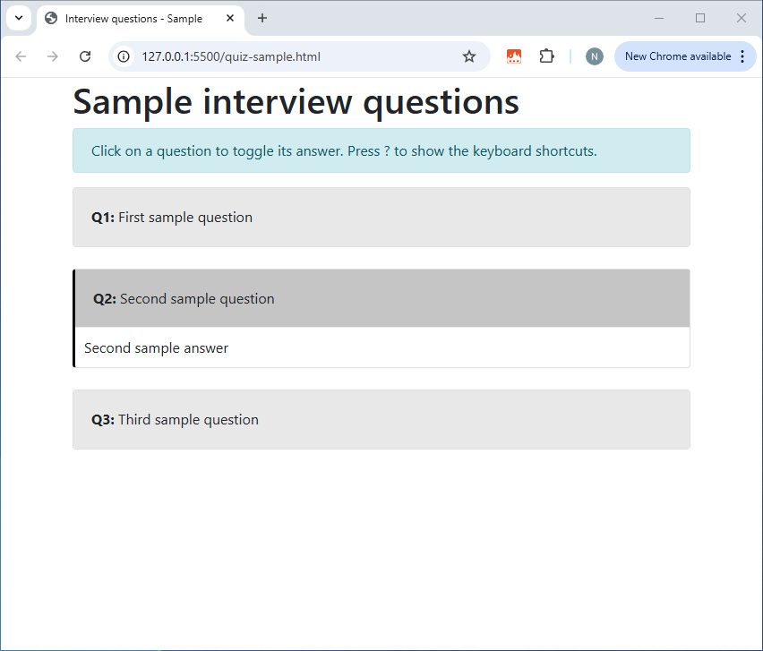
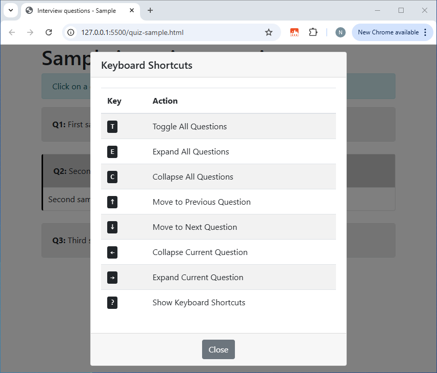

# coding-interview

## Intro

## Example

Here is a sample page with a quiz containing three questions. The questions and the answers can contain embedded HTML elements if required.

```html
<!DOCTYPE html>
<html lang="en">

<head>
    <meta charset="UTF-8">
    <meta name="viewport" content="width=device-width, initial-scale=1.0">
    <title>Interview questions - Sample</title>
    <link href="https://stackpath.bootstrapcdn.com/bootstrap/4.5.2/css/bootstrap.min.css" rel="stylesheet">
    <link href="styles/shortcuts.css" rel="stylesheet">
    <link href="styles/quiz.css" rel="stylesheet">
</head>

<body class="container">
    <h1>Sample interview questions</h1>

    <my-quiz>
        <my-pair>
            <my-question>First sample question (can contain HTML)</my-question>
            <my-answer>First sample answer (can contain HTML)</my-answer>
        </my-pair>

        <my-pair>
            <my-question>Second sample question (can contain HTML)</my-question>
            <my-answer>Second sample answer (can contain HTML)</my-answer>
        </my-pair>

        <my-pair>
            <my-question>Third sample question (can contain HTML)</my-question>
            <my-answer>Third sample answer (can contain HTML)</my-answer>
        </my-pair>
    </my-quiz>
</body>

<!-- Bootstrap JS and dependencies -->
<script src="https://code.jquery.com/jquery-3.5.1.slim.min.js"></script>
<script src="https://cdn.jsdelivr.net/npm/@popperjs/core@2.9.2/dist/umd/popper.min.js"></script>
<script src="https://stackpath.bootstrapcdn.com/bootstrap/4.5.2/js/bootstrap.min.js"></script>

<!-- quiz.js depends on shortcuts.js -->
<script src="scripts/shortcuts.js"></script>
<script src="scripts/quiz.js"></script>

</html>
```

Here is how the page looks after the second question has been expanded (using the mouse or the right arrow key <kbd>→</kbd>) to reveal its answer. In particular, note how the message at the top is added automatically, how the questions are numbered automatically, and how the current question is highlighted. The message and the highlighting will disappear when the page is printed.



There are keyboard shortcuts for navigating through the questions and expanding or collapsing them.

To show the help for the keyboard shortcuts, press <kbd>?</kbd>.

To hide it, press <kbd>?</kbd> or <kbd>Esc</kbd>, click the *Close* button, or click outside the dialog box.



## How to create a new quiz

* Copy an existing quiz (eg `quiz-sample.html`)
* Modify `<title>` and `<h1>`
* Delete the content of `<my-quiz>`
* For each question/answer pair, add a `<my-pair>` containing exactly one `<my-question>` followed by one `<my-answer>`

```html
<my-pair>
    <my-question>Question text here (can contain HTML)</my-question>
    <my-answer>Answer text here (can contain HTML)</my-answer>
</my-pair>
```

> [!NOTE]
> Ensure that the page includes the two CSS files (`shortcuts.css` and `quiz.css`) in `<head>` and the two JS files (`shortcuts.js` and `quiz.js`) after `<body>`. `shortcuts.js` must be included before `quiz.js`.

## Files

* `index.html` - List of all the sample quizzes
* `quiz-*.html` - Sample quizzes
* `styles/shortcuts.css` - Styling for the keyboard shortcuts help
* `styles/quiz.css` - Styling for the questions & answers
* `scripts/shortcuts.js` - Code for binding keyboard shortcuts to actions
* `scripts/quiz.js` - Code for the custom tags 
* `ai-generation/` - Contains a Python script to generate quizzes automatically using the Anthropic API (Claude AI)
