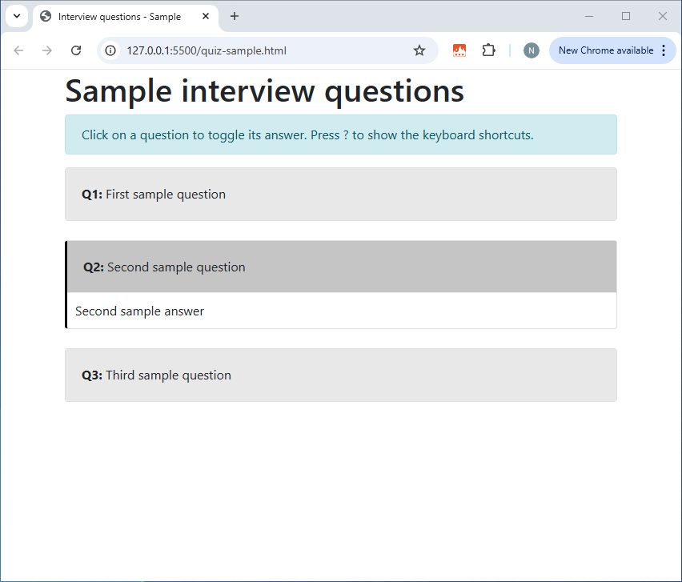
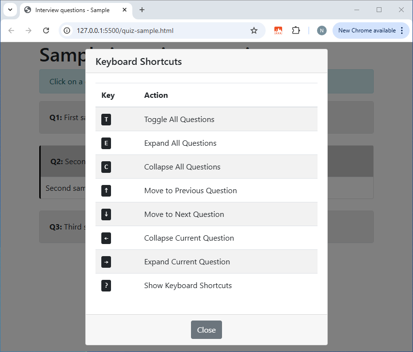

# coding-interview

## Intro

## Example

```html
<!DOCTYPE html>
<html lang="en">

<head>
    <meta charset="UTF-8">
    <meta name="viewport" content="width=device-width, initial-scale=1.0">
    <title>Interview questions - Sample</title>
    <link href="https://stackpath.bootstrapcdn.com/bootstrap/4.5.2/css/bootstrap.min.css" rel="stylesheet">
    <link href="styles/shortcuts.css" rel="stylesheet">
    <link href="styles/quiz.css" rel="stylesheet">
</head>

<body class="container">
    <h1>Sample interview questions</h1>

    <my-quiz>
        <my-pair>
            <my-question>First sample question</my-question>
            <my-answer>First sample answer</my-answer>
        </my-pair>

        <my-pair>
            <my-question>Second sample question</my-question>
            <my-answer>Second sample answer</my-answer>
        </my-pair>

        <my-pair>
            <my-question>Third sample question</my-question>
            <my-answer>Third sample answer</my-answer>
        </my-pair>
    </my-quiz>
</body>

<!-- Bootstrap JS and dependencies -->
<script src="https://code.jquery.com/jquery-3.5.1.slim.min.js"></script>
<script src="https://cdn.jsdelivr.net/npm/@popperjs/core@2.9.2/dist/umd/popper.min.js"></script>
<script src="https://stackpath.bootstrapcdn.com/bootstrap/4.5.2/js/bootstrap.min.js"></script>

<!-- quiz.js depends on shortcuts.js -->
<script src="scripts/shortcuts.js"></script>
<script src="scripts/quiz.js"></script>

</html>
```



To show the help for the keyboard shortcuts, press <kbd>?</kbd>.

To hide it, press <kbd>?</kbd> or <kbd>Esc</kbd>, click the *Close* button, or click outside the dialog box.



## Files

* _index.html_ - List of all the sample quizzes
* _quiz-*.html_ - Sample quizzes
* _styles/shortcuts.css_ - Styling for the keyboard shortcuts help
* _styles/quiz.css_ - Styling for the questions & answers
* _scripts/shortcuts.js_ - Code for binding keyboard shortcuts to actions
* _scripts/quiz.js_ - Code for the custom tags 
